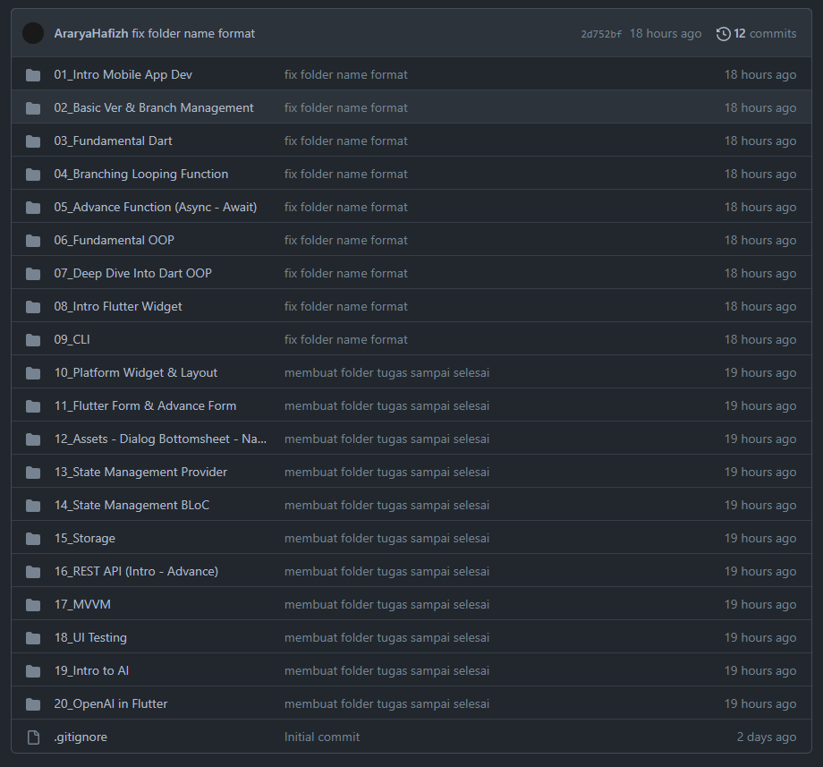

## Soal Prioritas 1

1. membuat repo dengan format namakelas_nama
2. buat folder di repo dengan nama setiap materi
3. buat 3 subfolder pada setiap folder:
   - praktikum
   - screenshots
   - readme.md

jawaban:

1. 

       
      

   <!---->
2. 

       
      

   <!---->
3. 

    
   

## Soal Prioritas 2

1. membuat repo pada github
2. memebuat branch pada repo:
   - master
   - development
   - featureA
   - featureB
3. menggunakan command git:
   - pull
   - push
   - stash
   - merge
4. mencoba menanggani conflict pada branch

jawaban:

    

<!---->

    

<!---->

    

