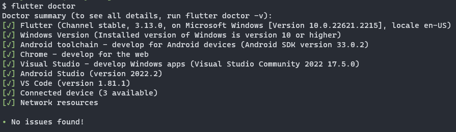
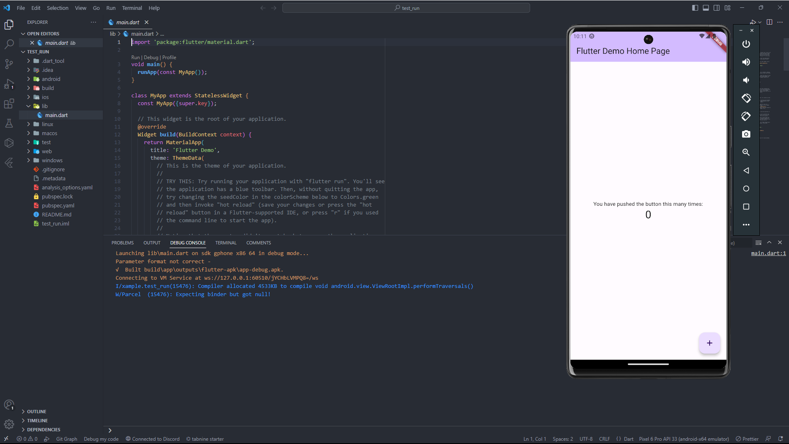

## Prioritas 1
1. Sebutkan 3 aplikasi yang dibangun menggunakan teknologi Flutter! lalu screenshot
2. Tampilkan informasi software yang dibutuhkan oleh Flutter dengan menggunakan perintah Flutter doctor! lalu screenshot
3. Buatlah sebuah project flutter (jika flutter berhasil dibuat tapi masih belum bisa tampil, maka masuk ke nilai prioritas 1)

jawaban:
1. [eBay Motors](https://flutter.dev/showcase/ebay)\
[BMW Mboile](https://flutter.dev/showcase/bmw)\
[Google Pay](https://flutter.dev/showcase/google-pay)
1. Flutter Doctor:
1. Project Flutter:
## Prioritas 2
1. Setelah project dibuat, jalankan di emulator 
    - (jika pada tampilan telah keluar project flutter seperti gambar di bawah maka telah berhasil mendapatkan nilai prioritas 2)
    
jawaban:
1. Project Flutter: