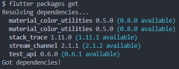
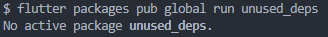
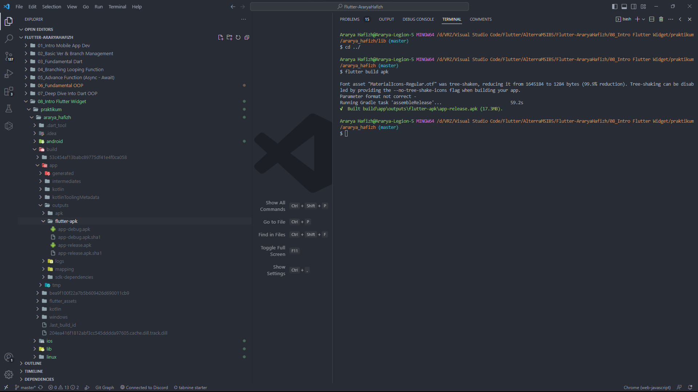
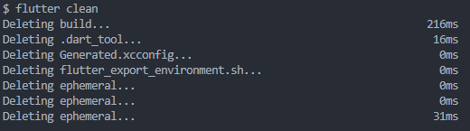
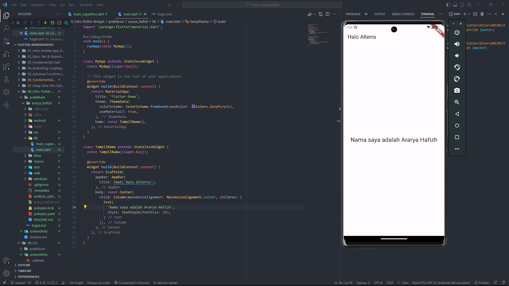

## Prioritas 1
1. Instal paket pada proyek Flutter menggunakan Flutter CLI:
Instruksi: flutter packages get
Contoh: flutter packages get
2. Hapus paket yang tidak digunakan pada proyek Flutter menggunakan Flutter CLI:
Instruksi: flutter packages pub global run unused_deps
Contoh: flutter packages pub global run unused_deps
3. Aktifkan Hot Reload pada proyek Flutter menggunakan Flutter CLI:
Instruksi: flutter run --hot-reload
Contoh: flutter run --hot-reload
4. Buat APK atau IPA untuk proyek Flutter menggunakan Flutter CLI:
Instruksi: flutter build apk (untuk Android) atau flutter build ios (untuk iOS)
Contoh: flutter build apk
5. Bersihkan cache pada proyek Flutter menggunakan Flutter CLI:
Instruksi: flutter cleans
Contoh: flutter clean

jawaban:
1. 

1. 

1. 

1. 

1. 

## Prioritas 2
1. 

